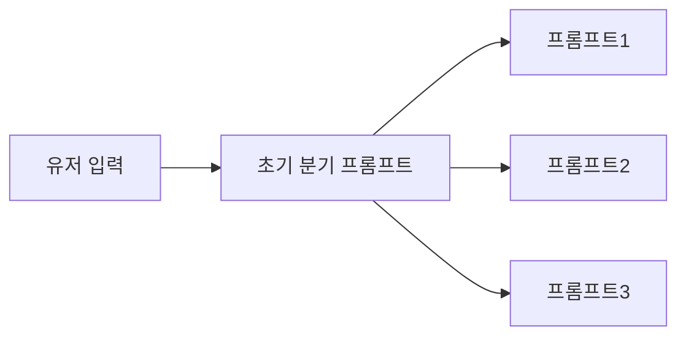

# mermaid-test

```mermaid
    flowchart LR
        id1["유저 입력"]
        id2["초기 분기 프롬프트"]
        id3["프롬프트1"]
        id4["프롬프트2"]
        id5["프롬프트3"]
        id1 --> id2
        id2 --> id3
        id2 --> id4
        id2 --> id5
```
