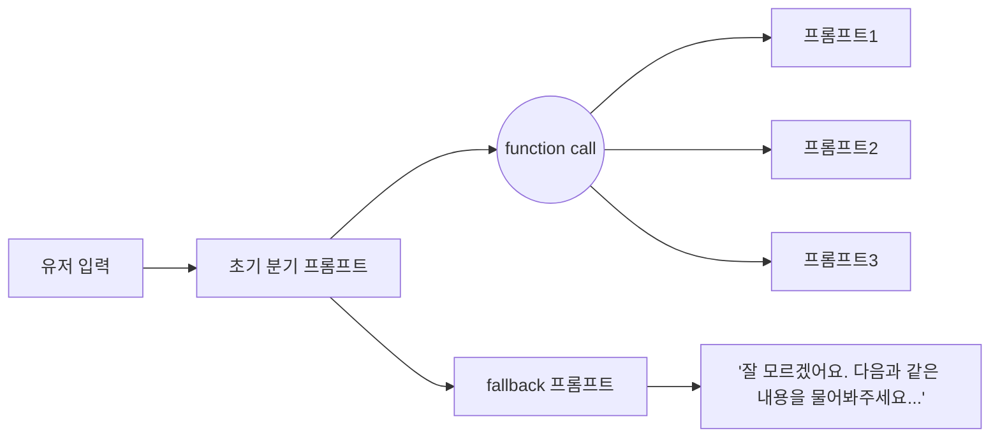

# mermaid-test

```mermaid
    flowchart LR
        id1["유저 입력"]
        id2["초기 분기 프롬프트"]
        id8(("function call"))
        id3["프롬프트1"]
        id4["프롬프트2"]
        id5["프롬프트3"]
        id6["fallback 프롬프트"]
        id7["'잘 모르겠어요. 다음과 같은 내용을 물어봐주세요...'"]
        id1 --> id2
        id2 --> id8
        id8 --> id3
        id8 --> id4
        id8 --> id5
        id2 --> id6
        id6 --> id7
```
